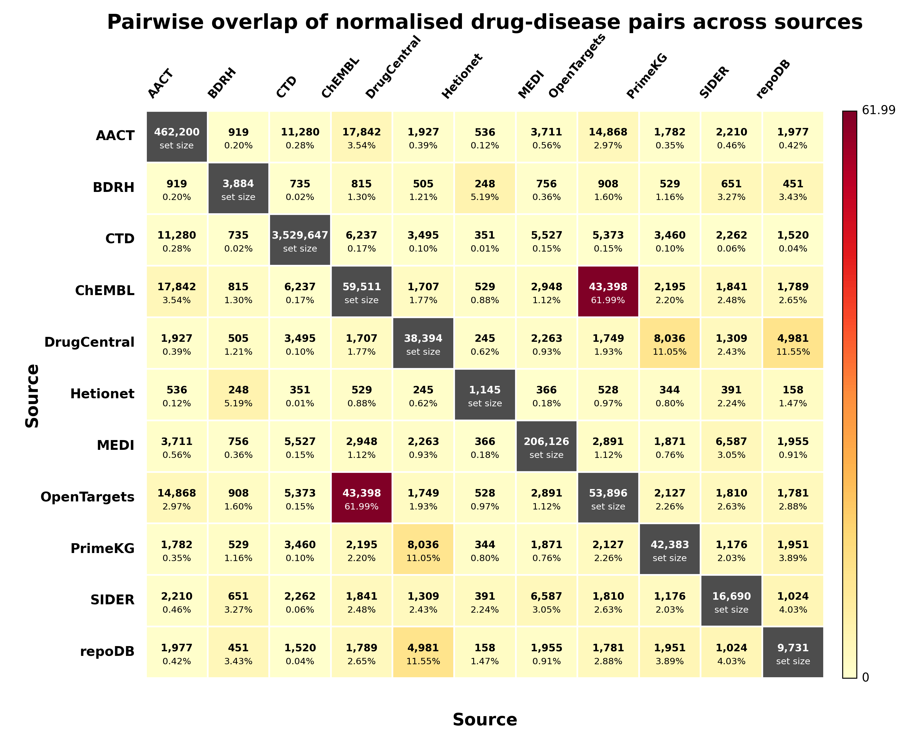

 
# Drug–Disease Association Data Pipeline

A reproducible, source-aware pipeline for downloading, processing, harmonising, merging, and deduplicating drug–disease relationships from public biomedical resources.

This repository was created to build an analysis-ready drug–disease relationship dataset while preserving source provenance, relationship semantics, and evidence type. The dataset should be interpreted as a heterogeneous biomedical relationship resource, not as a database of uniformly approved drug indications.



---
## Licence

The source code in this repository is released under the **MIT Licence**.

This licence applies only to the pipeline code, analysis scripts, documentation, and repository materials created for this project. The integrated drug–disease dataset is derived from multiple third-party public biomedical databases, and each original data source retains its own licence, terms of use, attribution requirements, and redistribution conditions.

Users must therefore follow the licence and reuse terms of each original database when using, redistributing, or building upon the processed dataset. In particular, some sources may have non-commercial, attribution, share-alike, or redistribution-sensitive conditions.

In summary:

- **Pipeline code:** MIT Licence.
- **Processed integrated dataset:** Use according to the licence and reuse terms of the original source databases.
- **Third-party source data:** Remain governed by their respective database licences and terms of use.
- **Citation:** Users should cite this Zenodo dataset and the original databases used in their analysis.

This repository does not override or replace the licence terms of AACT / ClinicalTrials.gov, ChEMBL, CTD, DrugCentral, Open Targets, SIDER, Hetionet, MEDI, PrimeKG, Broad Drug Repurposing Hub, repoDB, or any other upstream data source.


## Data availability

The processed dataset is available on Zenodo:

- **DOI:** https://doi.org/10.5281/zenodo.18308460  
- **Zenodo record:** https://zenodo.org/records/18308460  

Please cite the Zenodo dataset and the original source databases when using this resource.

---

## Overview

The pipeline integrates drug–disease, chemical–disease, clinical trial intervention–condition, medication–indication, drug repurposing, and knowledge-graph compound–disease relationships from public biomedical sources.

The current release integrates **11 included sources**:

1. AACT / ClinicalTrials.gov  
2. ChEMBL  
3. Comparative Toxicogenomics Database  
4. DrugCentral  
5. Open Targets Platform  
6. SIDER 4.1  
7. Hetionet  
8. MEDI  
9. PrimeKG  
10. Broad Drug Repurposing Hub  
11. repoDB  

The pipeline standardises each source into a common schema, preserves source-specific metadata, merges all records, performs schema-record deduplication, and generates downstream quality-control summaries and overlap analyses.

---

## Current dataset summary

| Metric | Value |
|---|---:|
| Included sources | 11 |
| Raw merged rows | 10,870,837 |
| Source-level deduplicated rows | 4,465,457 |
| Duplicates removed | 6,405,380 |
| Duplicate-removal rate | 58.923% |
| Source-collapsed schema-level records | 4,464,947 |
| Unique normalised drug names | 152,957 |
| Unique normalised disease/condition names | 69,346 |
| Unique normalised drug–disease name pairs | 4,300,425 |
| Rows with both drug and disease identifiers | 3,976,485 |
| Rows with neither identifier | 488,945 |

Deduplication was performed using a schema-record key consisting of:

```text
drug_name
drug_identifier
drug_identifier_type
disease_or_condition_name
disease_or_condition_identifier
disease_or_condition_identifier_type
relationship_type
evidence_type
source
````

This means that records from different sources, or records with different relationship or evidence semantics, are retained separately.

---

## Data sources

| Source                     | Script           | Access point                                                                                                               | Description and interpretation                                                                                                                                                                                  | Reuse note                                                                  |
| -------------------------- | ---------------- | -------------------------------------------------------------------------------------------------------------------------- | --------------------------------------------------------------------------------------------------------------------------------------------------------------------------------------------------------------- | --------------------------------------------------------------------------- |
| AACT / ClinicalTrials.gov  | `aact.py`        | [https://ctti-aact.nyc3.digitaloceanspaces.com](https://ctti-aact.nyc3.digitaloceanspaces.com)                             | Clinical trial intervention–condition records generated from AACT flat files. These represent clinical trial co-occurrence and should not be interpreted as approved indications or positive efficacy evidence. | Public clinical trial data; verify AACT and ClinicalTrials.gov reuse terms. |
| ChEMBL                     | `chembl.py`      | [https://ftp.ebi.ac.uk/pub/databases/chembl/ChEMBLdb/latest/](https://ftp.ebi.ac.uk/pub/databases/chembl/ChEMBLdb/latest/) | Curated drug indication and clinical-phase evidence extracted from ChEMBL drug indication tables.                                                                                                               | ChEMBL reuse terms; attribution required.                                   |
| CTD                        | `ctd.py`         | [https://ctdbase.org/reports/](https://ctdbase.org/reports/)                                                               | Broad chemical–disease association source. CTD records include curated and inferred chemical–disease links and should not be interpreted as approved drug indications.                                          | Verify CTD reuse terms.                                                     |
| DrugCentral                | `drugcentral.py` | [https://drugcentral.org/download](https://drugcentral.org/download)                                                       | Structured drug–condition clinical relationship source. Relationship labels include indication, contraindication, off-label use, treatment, diagnosis, and risk reduction.                                      | Verify DrugCentral reuse terms.                                             |
| Open Targets Platform      | `opentargets.py` | [https://ftp.ebi.ac.uk/pub/databases/opentargets](https://ftp.ebi.ac.uk/pub/databases/opentargets)                         | Drug–disease clinical indication evidence with clinical phase and reference metadata.                                                                                                                           | Open Targets reuse terms.                                                   |
| SIDER 4.1                  | `sider.py`       | [https://sideeffects.embl.de/](https://sideeffects.embl.de/)                                                               | Label-derived indication records extracted from SIDER indication files.                                                                                                                                         | Verify SIDER reuse terms.                                                   |
| Hetionet                   | `hetionet.py`    | [https://github.com/hetio/hetionet](https://github.com/hetio/hetionet)                                                     | Biomedical knowledge-graph compound–disease relationships. Retained edges include compound-treats-disease and compound-palliates-disease.                                                                       | CC0.                                                                        |
| MEDI                       | `MEDI.py`        | [https://www.vumc.org/wei-lab/medi](https://www.vumc.org/wei-lab/medi)                                                     | Medication–indication ensemble resource. ICD-coded and UMLS-coded MEDI records are processed separately.                                                                                                        | CC BY-NC-SA; redistribution-sensitive.                                      |
| PrimeKG                    | `PrimeKG.py`     | [https://doi.org/10.7910/DVN/IXA7BM](https://doi.org/10.7910/DVN/IXA7BM)                                                   | Biomedical knowledge-graph drug–disease relationships. Retained relationships include indication, contraindication, and off-label use.                                                                          | MIT licence noted in source documentation.                                  |
| Broad Drug Repurposing Hub | `Broad.py`       | [https://repo-hub.broadinstitute.org/repurposing](https://repo-hub.broadinstitute.org/repurposing)                         | Drug repurposing and development-stage annotation source. Indication fields are expanded into drug–condition rows.                                                                                              | Non-commercial / redistribution-sensitive.                                  |
| repoDB                     | `repoDB.py`      | [https://unmtid-shinyapps.net/shiny/repodb/](https://unmtid-shinyapps.net/shiny/repodb/)                                   | Drug repositioning and indication-status resource. Approved records and failed/discontinued records are retained with separate evidence labels.                                                                 | Verify repoDB reuse terms.                                                  |

---

## Scripts in this repository

| Script                                            | Purpose                                                                                                     |
| ------------------------------------------------- | ----------------------------------------------------------------------------------------------------------- |
| `aact.py`                                         | Downloads and processes AACT / ClinicalTrials.gov intervention–condition data.                              |
| `chembl.py`                                       | Downloads the latest ChEMBL SQLite release and extracts drug indication evidence.                           |
| `ctd.py`                                          | Processes CTD chemical–disease association files.                                                           |
| `drugcentral.py`                                  | Processes DrugCentral drug–condition relationship records.                                                  |
| `opentargets.py`                                  | Processes Open Targets clinical indication, drug molecule, and disease files.                               |
| `sider.py`                                        | Processes SIDER drug indication files.                                                                      |
| `MEDI.py`                                         | Processes MEDI-2 ICD-coded and UMLS-coded medication–indication files.                                      |
| `hetionet.py`                                     | Processes Hetionet compound–disease edges.                                                                  |
| `PrimeKG.py`                                      | Processes PrimeKG drug–disease relationships.                                                               |
| `Broad.py`                                        | Processes Broad Drug Repurposing Hub annotation data.                                                       |
| `repoDB.py`                                       | Processes locally downloaded repoDB full dataset.                                                           |
| `TTD.py`                                          | Processes Therapeutic Target Database drug–disease mapping files.                                           |
| `openFDA.py`                                      | Downloads openFDA label partitions for inspection; not currently used to build final drug–disease mappings. |
| `Analysis_00_MergeDatabases.py`                   | Merges harmonised source outputs into a unified dataset and performs deduplication.                         |
| `Analysis_01_Source_level_dataset_composition.py` | Generates source-level composition summaries and overlap analyses.                                          |

---

## Pipeline architecture

```text
Raw public source files
        |
        v
Source-specific processing scripts
        |
        v
Unified drug–disease schema
        |
        v
Merged source-level dataset
        |
        v
Schema-record deduplication
        |
        v
Source-aware deduplicated dataset
        |
        v
Quality-control and overlap analyses
```

---

## Harmonised output schema

The integrated dataset uses a common source-aware schema. Core fields include:

| Column                                 | Description                                                                                                                                                       |
| -------------------------------------- | ----------------------------------------------------------------------------------------------------------------------------------------------------------------- |
| `drug_name`                            | Drug, compound, chemical, or intervention name.                                                                                                                   |
| `drug_identifier`                      | Source-provided or harmonised drug identifier where available.                                                                                                    |
| `drug_identifier_type`                 | Identifier namespace for the drug identifier.                                                                                                                     |
| `disease_or_condition_name`            | Disease, condition, indication, phenotype, or clinical trial condition name.                                                                                      |
| `disease_or_condition_identifier`      | Source-provided or harmonised disease/condition identifier where available.                                                                                       |
| `disease_or_condition_identifier_type` | Identifier namespace for the disease/condition identifier.                                                                                                        |
| `relationship_type`                    | Harmonised relationship class, such as indication, contraindication, off-label use, clinical trial drug–condition co-occurrence, or chemical–disease association. |
| `evidence_type`                        | Source-specific evidence class describing how the relationship should be interpreted.                                                                             |
| `source`                               | Primary source database.                                                                                                                                          |
| `internal_source`                      | Source-specific subcategory or processing layer.                                                                                                                  |
| `extra_metadata`                       | Source-specific metadata preserved as structured information where available.                                                                                     |

---

## Evidence and relationship interpretation

The dataset intentionally preserves heterogeneous evidence semantics. Records should not be interpreted as equivalent.

Examples of retained evidence classes include:

| Evidence class                                    | Interpretation                                                           |
| ------------------------------------------------- | ------------------------------------------------------------------------ |
| `chemical_disease_association`                    | CTD chemical–disease association; not necessarily therapeutic.           |
| `aact_clinical_trial_drug_condition_cooccurrence` | Drug intervention and condition co-occurrence in clinical trial records. |
| `curated_drug_indication`                         | Curated ChEMBL drug indication evidence.                                 |
| `opentargets_clinical_indication`                 | Open Targets clinical indication evidence with clinical phase metadata.  |
| `sider_label_derived_indication`                  | Drug indication evidence extracted from drug labels.                     |
| `medi_high_precision_indication`                  | High-precision MEDI medication–indication evidence.                      |
| `medi_ensemble_indication`                        | Broader MEDI ensemble medication–indication evidence.                    |
| `drugcentral_indication`                          | DrugCentral indication relationship.                                     |
| `drugcentral_contraindication`                    | DrugCentral contraindication relationship.                               |
| `drugcentral_off_label_use`                       | DrugCentral off-label use relationship.                                  |
| `primekg_indication`                              | PrimeKG knowledge-graph indication relationship.                         |
| `primekg_contraindication`                        | PrimeKG knowledge-graph contraindication relationship.                   |
| `primekg_off_label_use`                           | PrimeKG knowledge-graph off-label use relationship.                      |
| `repodb_approved_indication`                      | repoDB approved indication status.                                       |
| `repodb_failed_or_discontinued_indication`        | repoDB failed, terminated, withdrawn, suspended, or discontinued status. |
| `hetionet_compound_treats_disease`                | Hetionet compound-treats-disease edge.                                   |
| `hetionet_compound_palliates_disease`             | Hetionet compound-palliates-disease edge.                                |
| `broad_repurposing_hub`                           | Broad Drug Repurposing Hub annotation evidence.                          |

---

## Source-level composition

| Source                     | Raw merged rows | Deduplicated rows | Duplicates removed | Duplicates removed (%) | Unique normalised drug names | Unique normalised disease names | Unique normalised drug–disease name pairs |
| -------------------------- | --------------: | ----------------: | -----------------: | ---------------------: | ---------------------------: | ------------------------------: | ----------------------------------------: |
| CTD                        |       9,735,698 |         3,530,168 |          6,205,530 |                 63.740 |                       17,835 |                           7,278 |                                 3,529,647 |
| AACT                       |         671,335 |           485,060 |            186,275 |                 27.747 |                      130,823 |                          50,813 |                                   462,200 |
| MEDI                       |         222,412 |           222,412 |                  0 |                  0.000 |                        3,056 |                          13,233 |                                   206,126 |
| ChEMBL                     |          59,887 |            59,583 |                304 |                  0.508 |                       10,054 |                           2,543 |                                    59,511 |
| OpenTargets                |          53,950 |            53,950 |                  0 |                  0.000 |                       11,401 |                           3,080 |                                    53,896 |
| PrimeKG                    |          42,631 |            42,631 |                  0 |                  0.000 |                        2,074 |                           2,054 |                                    42,383 |
| DrugCentral                |          38,430 |            38,397 |                 33 |                  0.086 |                        2,775 |                           2,664 |                                    38,394 |
| SIDER                      |          29,834 |            17,654 |             12,180 |                 40.826 |                        1,281 |                           3,043 |                                    16,690 |
| repoDB                     |          11,623 |            10,572 |              1,051 |                  9.042 |                        2,321 |                           1,462 |                                     9,731 |
| Broad Drug Repurposing Hub |           3,892 |             3,885 |                  7 |                  0.180 |                        2,221 |                             670 |                                     3,884 |
| Hetionet                   |           1,145 |             1,145 |                  0 |                  0.000 |                          551 |                              91 |                                     1,145 |
| **Total**                  |  **10,870,837** |     **4,465,457** |      **6,405,380** |             **58.923** |                            — |                               — |                                         — |

---

## Normalised-name coverage

| Metric                                                |     Value |
| ----------------------------------------------------- | --------: |
| Total source-level deduplicated rows                  | 4,465,457 |
| Included sources                                      |        11 |
| Unique normalised drug names                          |   152,957 |
| Unique normalised disease/condition names             |    69,346 |
| Unique normalised drug–disease name pairs             | 4,300,425 |
| Rows with drug identifier                             | 3,976,512 |
| Rows with disease/condition identifier                | 3,976,485 |
| Rows with both drug and disease/condition identifiers | 3,976,485 |
| Rows with neither identifier                          |   488,945 |
| Drug identifier row coverage                          |   89.051% |
| Disease/condition identifier row coverage             |   89.050% |
| Both identifier row coverage                          |   89.050% |
| Neither identifier row coverage                       |   10.949% |

---

## Cross-source overlap

Cross-source overlap was calculated using normalised names rather than strict source-specific identifiers. This was done because the included sources use heterogeneous identifier namespaces.

| Level                  | Source-key rows | Source-collapsed keys | Single-source keys | Single-source (%) | Multi-source keys | Multi-source (%) | Max sources |
| ---------------------- | --------------: | --------------------: | -----------------: | ----------------: | ----------------: | ---------------: | ----------: |
| Drug                   |         169,787 |               138,219 |            126,362 |            91.422 |            11,857 |            8.578 |          11 |
| Disease/condition      |          85,389 |                67,284 |             58,919 |            87.568 |             8,365 |           12.432 |          11 |
| Drug–disease name pair |       4,385,333 |             4,253,477 |          4,164,802 |            97.915 |            88,675 |            2.085 |          11 |

The heatmap at the top of this README shows pairwise overlap between sources at the normalised drug–disease name-pair level.

---

## Download behaviour

| Source                     | Download behaviour                                                                                     |
| -------------------------- | ------------------------------------------------------------------------------------------------------ |
| AACT                       | Uses a pinned AACT ZIP export and reads `interventions.txt`, `conditions.txt`, and `studies.txt`.      |
| CTD                        | Downloads CTD chemical–disease reports from CTD.                                                       |
| ChEMBL                     | Dynamically resolves the latest ChEMBL SQLite archive from the official FTP directory.                 |
| DrugCentral                | Uses the DrugCentral dump or public PostgreSQL connection details.                                     |
| Open Targets               | Downloads release-specific parquet files for clinical indication, drug molecule, and disease datasets. |
| SIDER                      | Tries HTTPS and HTTP download locations for SIDER indication files.                                    |
| MEDI                       | Downloads MEDI-2 ICD-coded and UMLS-coded files.                                                       |
| Hetionet                   | Downloads Hetionet v1.0 nodes and edges from GitHub.                                                   |
| PrimeKG                    | Downloads PrimeKG from Harvard Dataverse.                                                              |
| Broad Drug Repurposing Hub | Processes Broad Repurposing Hub annotation files.                                                      |
| repoDB                     | Expects the full repoDB TSV to be downloaded manually and placed locally.                              |
| TTD                        | Processes TTD drug–disease and crossmatching files.                                                    |
| openFDA                    | Reads the openFDA download manifest and downloads label files for inspection only.                     |

---

## Installation

```bash
pip install requests pandas polars duckdb psycopg2-binary pyarrow
```

Additional standard-library modules used by some scripts include:

```text
sqlite3
tarfile
gzip
json
pathlib
zipfile
```

---

## Example usage

Run individual source-processing scripts first:

```bash
python aact.py
python chembl.py
python ctd.py
python drugcentral.py
python opentargets.py
python sider.py
python MEDI.py
python hetionet.py
python PrimeKG.py
python Broad.py
python repoDB.py
```

Then merge and deduplicate the harmonised outputs:

```bash
python Analysis_00_MergeDatabases.py
```

Generate source-level composition and overlap summaries:

```bash
python Analysis_01_Source_level_dataset_composition.py
```

---

## Output files

The main outputs are generated in the processed data directory.

| Output                                                   | Description                                                                                                          |
| -------------------------------------------------------- | -------------------------------------------------------------------------------------------------------------------- |
| `ALL_INCLUDED_SOURCES_drug_disease_merged.csv`           | Raw merged source-level dataset containing all harmonised records before schema-record deduplication.                |
| `ALL_INCLUDED_SOURCES_drug_disease_deduplicated.csv`     | Source-level schema-record deduplicated dataset.                                                                     |
| `ALL_INCLUDED_SOURCES_drug_disease_source_collapsed.csv` | Source-collapsed representation aggregating records sharing the same schema-level drug and disease/condition fields. |
| `pairwise_drug_disease_pair_overlap_heatmap.png`         | Pairwise source overlap heatmap based on normalised drug–disease name pairs.                                         |

---

## Important limitations

This dataset is a source-aware biomedical relationship resource. It is not a manually validated list of approved therapeutic indications.

Important interpretation notes:

* AACT records represent clinical trial intervention–condition co-occurrence, not trial success or drug approval.
* CTD records represent chemical–disease associations and may include toxicological, inferred, or non-therapeutic relationships.
* Knowledge-graph sources such as Hetionet and PrimeKG should be interpreted as graph-derived relationships.
* DrugCentral, PrimeKG, and repoDB include relationship types such as contraindication, off-label use, failed indication, or discontinued indication.
* Normalised-name matching does not fully resolve drug synonyms, brand names, salt forms, stereochemistry, disease synonyms, or ontology hierarchy.
* Each source has its own licence and reuse conditions. Users should verify terms before redistribution or commercial use.

---

## Dataset citation

```bibtex
@dataset{muneeb_drug_disease_2026,
  author    = {Muneeb, Muhammad},
  title     = {Drug-Disease Association Data Pipeline and Unified Dataset},
  year      = {2026},
  publisher = {Zenodo},
  doi       = {10.5281/zenodo.18308460},
  url       = {https://doi.org/10.5281/zenodo.18308460}
}
```

---

## Source citations

Please cite the original sources where relevant.

```bibtex
@article{hetionet2017,
  title   = {Systematic integration of biomedical knowledge prioritizes drugs for repurposing},
  journal = {eLife},
  year    = {2017},
  doi     = {10.7554/eLife.26726}
}

@article{repodb2017,
  title   = {repoDB: a standard database for drug repositioning},
  journal = {Scientific Data},
  year    = {2017},
  doi     = {10.1038/sdata.2017.29}
}

@article{broad_repurposing_hub2017,
  title   = {An interactive resource to identify cancer genetic and lineage dependencies targeted by small molecules},
  journal = {Nature Medicine},
  year    = {2017},
  doi     = {10.1038/nm.4306}
}

@article{medi2013,
  title   = {Development and evaluation of an ensemble resource linking medications to their indications},
  journal = {Journal of the American Medical Informatics Association},
  year    = {2013},
  doi     = {10.1136/amiajnl-2012-001431}
}

@article{primekg2023,
  title   = {Building a knowledge graph to enable precision medicine},
  journal = {Scientific Data},
  year    = {2023},
  doi     = {10.1038/s41597-023-01960-3}
}

@article{chembl2024,
  title   = {ChEMBL: towards direct deposition of bioassay data},
  journal = {Nucleic Acids Research},
  year    = {2024},
  doi     = {10.1093/nar/gkad1004}
}

@article{ctd2025,
  title   = {The Comparative Toxicogenomics Database},
  journal = {Nucleic Acids Research},
  year    = {2025},
  doi     = {10.1093/nar/gkae883}
}

@article{drugcentral2023,
  title   = {DrugCentral 2023 extends human clinical data and integrates veterinary drugs},
  journal = {Nucleic Acids Research},
  year    = {2023},
  doi     = {10.1093/nar/gkac1085}
}
```

---

## Contact

**Muhammad Muneeb**

* Email: [muneebsiddique007@gmail.com](mailto:muneebsiddique007@gmail.com)
* Email: [m.muneeb@uq.edu.au](mailto:m.muneeb@uq.edu.au)
* GitHub: [https://github.com/MuhammadMuneeb007](https://github.com/MuhammadMuneeb007)
* Repository: [https://github.com/MuhammadMuneeb007/drug-disease-mapping](https://github.com/MuhammadMuneeb007/drug-disease-mapping)

 
